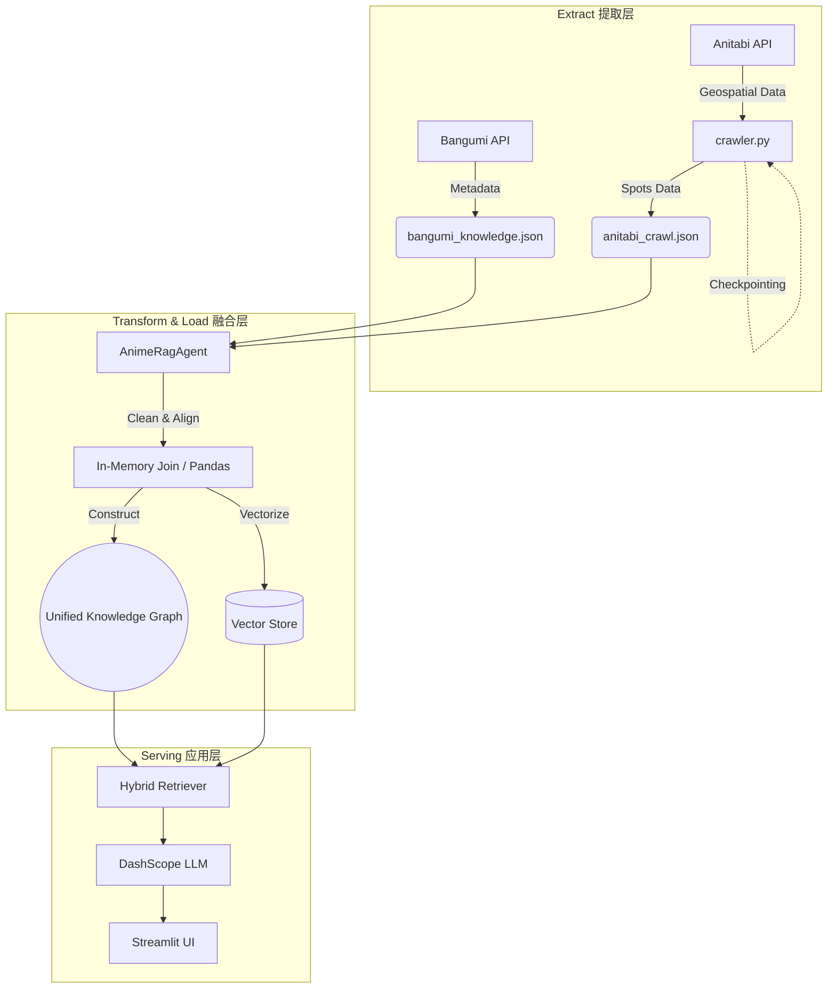

# ⛩️ AnimeWay | 二次元圣地巡礼智能助手

> **Break the Dimension Wall with Data & AI.**
> 
> 一个基于 **RAG (检索增强生成)** 与 **动态知识图谱** 的圣地巡礼规划系统。不仅是旅行助手，更是二次元数据的连接器。

<div align="center">

[](https://www.python.org/)
[](https://streamlit.io/)
[](https://github.com/QwenLM/Qwen)
[](LICENSE)

[English](#-english-intro) | [中文](#-project-overview)

</div>

---

## 📖 Project Overview

**AnimeWay** 致力于解决二次元圣地巡礼中的"信息孤岛"问题。它通过构建 **Unified Knowledge Graph (统一知识图谱)**，将分散在 Bangumi 的**剧情元数据**与 Anitabi 的**地理空间数据**进行实时融合，结合 LLM 的意图理解能力，提供从"模糊剧情回忆"到"精确物理坐标"的端到端导航。

### 🌟 核心功能 (Key Features)

#### 1. 🧠 认知型 AI Agent (Cognitive AI)
传统的搜索只能匹配关键词，AnimeWay 的 Agent 可以理解你的**意图**：
*   **Intent Recognition**: 能够区分闲聊 ("你好")、精准搜索 ("命运石之门的圣地")、模糊推荐 ("推荐几部治愈系的番") 等多种模式。
*   **Context-Aware**: 支持**多轮对话记忆**。你可以先问 "莉可丽丝的圣地在哪？"，然后紧接着问 "那里有什么好吃的？"，Agent 知道"那里"指代的是刚才讨论的地点。
*   **RAG Pipeline**: 针对二次元垂类优化的检索逻辑。例如输入 "少女歌剧"，系统自动对齐到标准名 "少女☆歌剧 Revue Starlight"，并检索其背后的几十个圣地坐标。

#### 2. 🔗 运行时数据融合 (Runtime Data Joining)
*   **Dynamic ETL**: 摒弃了传统的离线宽表模式。系统在启动时，会实时读取 `Bangumi` 的元数据 (7,900+ 条) 和 `Anitabi` 的地理数据 (8,000+ 点)，在内存中进行**实时连接 (Join)**。



*   **Heterogeneous Data Fusion**: 实现了非结构化文本 (简介/Tag) 与结构化数据 (经纬度/评分) 的多模态对齐，确保数据的实时性和一致性。

#### 3. 🕷️ 全量数据引擎 (Full Data Engine)
*   **Robust Crawler**: 内置工业级爬虫 `data_factory/crawler.py`。
    *   **全量同步**: 调用 Anitabi 的详细数据接口，获取完整的圣地坐标数据，确保巡礼信息的丰富性。
    *   **Checkpointing**: 支持断点续传。如果爬取中断，下次运行会自动从断点处继续，无需从头开始。

#### 4. 🗺️ 沉浸式可视化 (Immersive Visualization)
*   **3D Map**: 集成 **PyDeck** 3D 地图引擎，支持倾斜视角俯瞰圣地实景，提供比 2D 地图更直观的巡礼体验。
*   **TSP Optimization**: 内置旅行商问题 (TSP) 算法。当你添加了多个乱序的圣地后，系统会自动计算出**最短巡礼路径**，避免绕路。

---

## 🚀 User Guide (使用指南)

### 🏘️ 圣地观测 (Discover Tab)
这是你的情报中心。
1.  **自然语言交互**: 在聊天框输入你的需求。
    *   *Try:* "想去看看《孤独摇滚》的取景地"
    *   *Try:* "京都有什么动画圣地？"
2.  **查看结果**: Agent 会返回相关的番剧卡片。点击 **🚀 Deploy** 按钮，系统会展开该番剧下的所有圣地列表。
3.  **加入背包**:看到心仪的地点 (如 "下北泽 Shelter")，点击 **➕ Collect** 将其加入你的巡礼背包。

### 📅 冒险之书 (Plan Tab)
这是你的战术终端。
1.  **管理背包**: 在侧边栏或主界面查看已收集的圣地。
2.  **路径规划**: 
    *   输入 **出发地** (可选，如 "秋叶原站")。
    *   勾选 **🔄 开启时空折叠 (TSP)**，系统会自动重新排序你的景点，生成最优路线。
3.  **生成路书**: 点击 **🔮 生成圣地巡礼路书**。
    *   系统会调用高德地图 API 计算具体的交通/步行方案。
    *   AI 会为你撰写一份包含景点背景、打卡建议的**个性化巡礼指南**。
    *   最后，在 3D 地图上预览你的整个行程。

---

## 🛠️ Tech Stack

| Component | Technology | Description |
| :--- | :--- | :--- |
| **Frontend** | Streamlit | 快速构建响应式 Web UI，支持自定义 CSS (Glassmorphism)。 |
| **LLM** | DashScope (Qwen) | 通义千问大模型，负责意图识别 (NLU) 和路书生成 (NLG)。 |
| **Data Logic** | Pandas / Native Python | 负责数据的清洗、ETL 和运行时 Join。 |
| **Map Engine** | PyDeck / Amap API | 提供高精度的 3D 地图可视化和路径规划服务。 |
| **Crawler** | Requests / JSON | 健壮的数据爬取与持久化存储。 |

---

## 🚀 Quick Start

### 1. Installation
```bash
git clone https://github.com/YourUsername/AnimeWay.git
cd AnimeWay
pip install -r requirements.txt
```

### 2. Configuration
本项目依赖 **DashScope (通义千问)** 和 **高德地图 (AMap)** 服务。
在 `secrets.toml` 或直接在 UI 侧边栏输入 Key：
```bash
# Mac/Linux
export DASHSCOPE_API_KEY="sk-your-api-key"
# Windows (PowerShell)
$env:DASHSCOPE_API_KEY="sk-your-api-key"
```

### 3. Data Sync (Optional but Recommended)
虽然项目已内置核心数据，但建议定期同步最新数据：
```bash
# 启动全量爬虫 (支持断点续传)
python data_factory/crawler.py
```

### 4. Run App
```bash
streamlit run app.py
```

---

