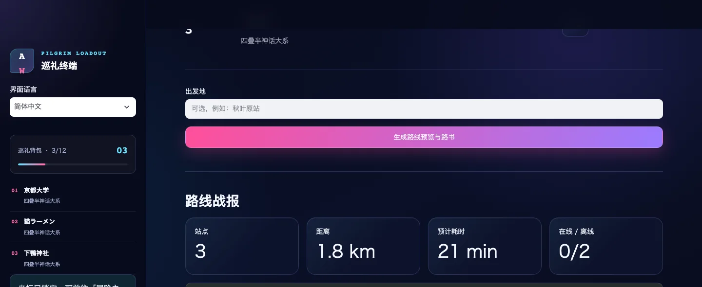
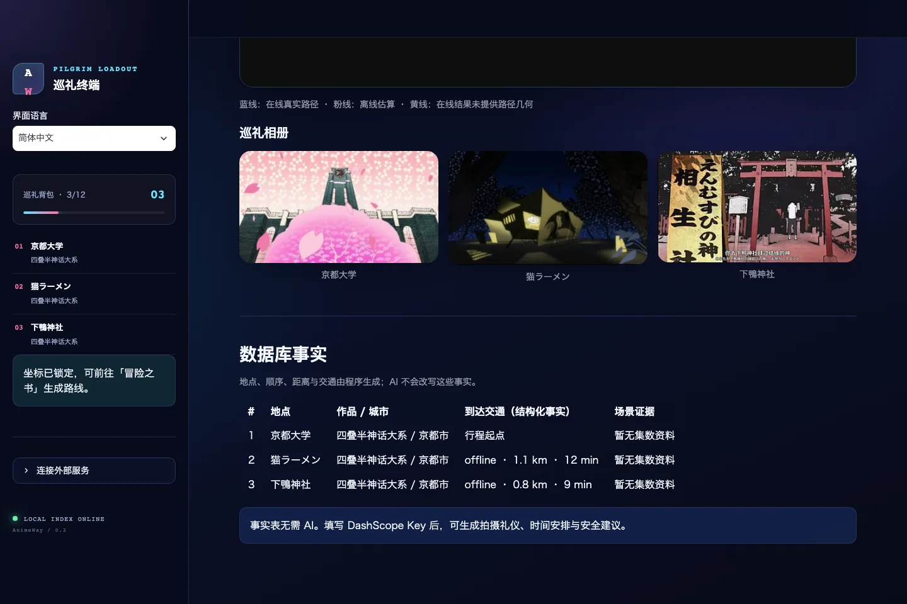

<div align="center">

<p><code>ANIME PILGRIMAGE NAVIGATOR · 聖地巡礼</code></p>

# AnimeWay · 二次元圣地巡礼助手

### 穿过次元壁，抵达故事发生的地方。

**从一句喜欢的作品，到一条真实可走的巡礼路线。**<br>
Turn anime memories into a journey you can actually take.<br>
物語の景色を、ほんとうの旅へ。

<br>


<br><br>


</div>

## 一句话，到一条巡礼路线

AnimeWay 是一款为动画旅行者准备的圣地巡礼工具。

输入作品、城市或想寻找的氛围，它会从本地知识库中找到真实匹配的取景地点；把喜欢的坐标装进「巡礼背包」，就能生成带有站点顺序、距离、耗时、地图与事实表的「冒险之书」。

作品、城市和主题检索不依赖大模型。没有地图 Key 时，也可以生成明确标注为离线估算的路线预览。

<p align="center">
  
</p>

> 上方为真实界面录制：`京都有什么动画圣地` → 收藏 3 个坐标 → 生成离线路线 → 查看数据库事实。演示未配置任何服务 Key。

## 你的巡礼，四步出发

| 01 · 观测 | 02 · 筛选 | 03 · 收藏 | 04 · 启程 |
|---|---|---|---|
| 输入作品、城市或主题 | 只展示通过相关性门槛的结果 | 将地点装进巡礼背包 | 生成路线、地图与事实路书 |
| `孤独摇滚圣地` | 不用热门作品强行兜底 | 最多 12 个坐标 | 在线失败时明确降级 |

可以直接试：

```text
孤独摇滚圣地
京都有什么动画圣地
咖啡店巡礼
推荐几部适合夏天巡礼的动画
```

## 产品一览

<table>
  <tr>
    <td width="50%">
      
    </td>
    <td width="50%">
      
    </td>
  </tr>
  <tr>
    <td align="center">
      <strong>次元观测站</strong><br>
      <sub>原创夜色车站主视觉、动态扫描线与三语界面</sub>
    </td>
    <td align="center">
      <strong>圣地坐标卡</strong><br>
      <sub>作品、城市、经纬度与真实点位图片一屏掌握</sub>
    </td>
  </tr>
</table>

<table>
  <tr>
    <td width="50%">
      
    </td>
    <td width="50%">
      
    </td>
  </tr>
  <tr>
    <td align="center">
      <strong>冒险之书</strong><br>
      <sub>站点、距离、耗时和在线/离线状态清晰可见</sub>
    </td>
    <td align="center">
      <strong>事实与建议分离</strong><br>
      <sub>结构化事实由程序生成，AI 只提供可选旅行建议</sub>
    </td>
  </tr>
</table>

## 为什么是 AnimeWay？

### 不需要 Key，也能开始

本地 SQLite / FTS 索引负责作品、城市、地点与主题检索。没有 DashScope Key 时，搜索、收藏和离线路线预览仍然可用。

### 宁可没有，也不要乱猜

搜索会先确认标题、地点、城市或主题发生真实匹配，再使用点位数量与热度排序。知识库没有足够相关的结果时，返回空结果。

### 事实是事实，建议是建议

地点、顺序、距离、耗时与交通字段由程序生成。AI 不能改写这些字段；缺少场景来源时，界面会明确显示「暂无集数资料」。

### 一份正在生长的圣地地图

当前随仓库提供的索引包含：

- **7,966** 部作品元数据
- **906** 部关联到圣地点位的作品
- **23,173** 个有效点位

数据规模以当前 `knowledge_base/index.json` 为准，会随知识库更新而变化。

## 30 秒本地启动

需要 Python 3.10–3.13。推荐使用 [uv](https://docs.astral.sh/uv/)：

```bash
git clone https://github.com/lanerchenbuna/AnimeWay.git
cd AnimeWay
uv sync --frozen
uv run streamlit run app.py
```

打开 `http://localhost:8501`，点击示例坐标或直接输入：

```text
京都有什么动画圣地
```

也可以使用 pip：

```bash
pip install -r requirements.txt
streamlit run app.py
```

## 可选在线能力

| 能力 | 是否需要 Key | 配置 |
|---|:---:|---|
| 作品 / 城市 / 主题检索 | 否 | — |
| 收藏地点与离线路线预览 | 否 | — |
| AI 推荐、攻略回答与行程建议 | 是 | `DASHSCOPE_API_KEY` 或侧边栏输入 |
| 出发地解析与在线路线 | 是 | `AMAP_API_KEY` 或侧边栏输入 |

Key 也可以只输入在当前 Streamlit 会话中，不会写入知识库。

> **地图能力说明**：当前在线路线接入高德 Web 服务。日本地区的地理编码、公交和铁路覆盖按 best-effort 使用；接口不可用或没有返回路径几何时，AnimeWay 会降级为离线估算并明确标记。详见 [地图服务覆盖与降级策略](docs/map-provider-coverage.md)。

## 中文 / English / 日本語

界面右侧栏支持 `简体中文 / English / 日本語` 即时切换。确定性的页面文案、路线事实和 AI 建议语言会跟随当前选择。

### English

AnimeWay turns anime-location discovery into a complete pilgrimage workflow. Search by title, city, place, or theme; save matching spots; then preview a route with stops, distance, duration, and clearly disclosed offline estimates.

Local search and offline route previews work without an LLM key. AI features are optional and remain separate from structured itinerary facts.

**Quick start**

```bash
uv sync --frozen
uv run streamlit run app.py
```

### 日本語

AnimeWay は、作品名・都市・場所・テーマからアニメの舞台を探し、気になる場所を「巡礼バッグ」に保存して、ひとつの旅程として確認できる聖地巡礼アプリです。

ローカル検索とオフライン経路プレビューは LLM キーなしで利用できます。AI は任意機能で、構造化された行程事実とは明確に分けて表示されます。

**クイックスタート**

```bash
uv sync --frozen
uv run streamlit run app.py
```

<details>
<summary><strong>开发与质量检查 / Development</strong></summary>

<br>

安装开发依赖：

```bash
uv sync --frozen --group dev
```

运行代码检查与测试：

```bash
uv run ruff check .
uv run mypy
uv run pytest --cov --cov-report=term-missing
```

更新原始数据后重建知识库：

```bash
python -m data_factory.build_kb
```

运行版本化检索质量集与性能门槛：

```bash
uv run python -m evaluation.run_eval
python -m evaluation.benchmark_retrieval
```

</details>

## 数据与责任边界

作品元数据和地点数据来自仓库中记录的外部来源，包括 [Bangumi](https://bgm.tv/) 与 [Anitabi](https://anitabi.cn/)。请遵守各来源的使用条款、署名要求与内容许可；外部数据、图片和品牌不会因为本项目代码采用 MIT License 而自动适用 MIT License。

地点、交通、开放状态与费用都可能变化。出发前请通过官方渠道再次确认，并尊重当地居民、店铺规则与拍摄礼仪。

## License

AnimeWay 的项目代码采用 [MIT License](LICENSE)。第三方数据、图片、地图与在线服务分别受其各自条款约束。
