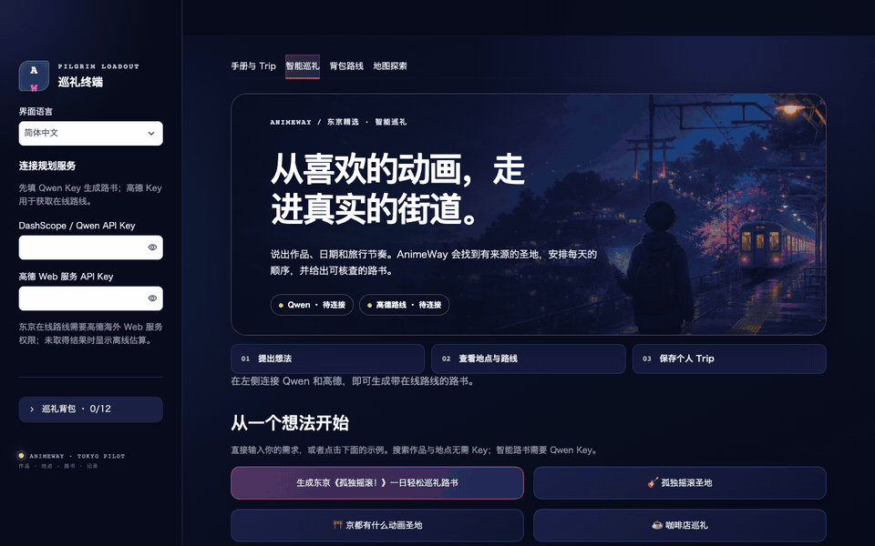
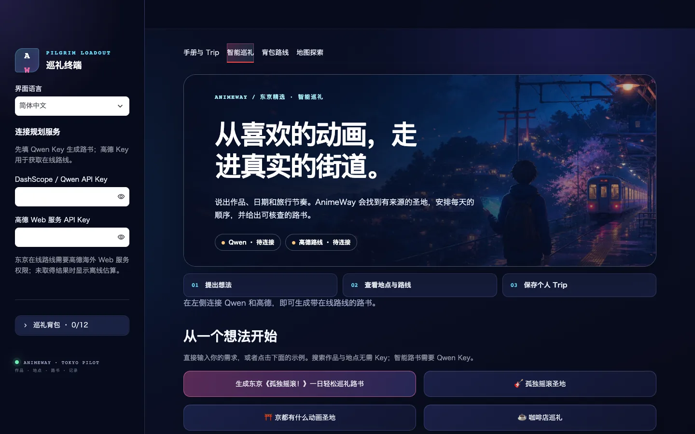
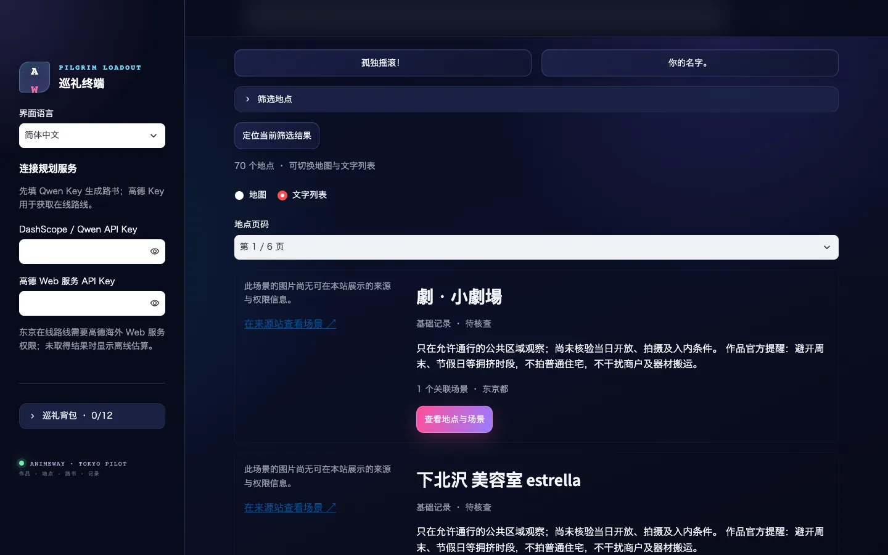
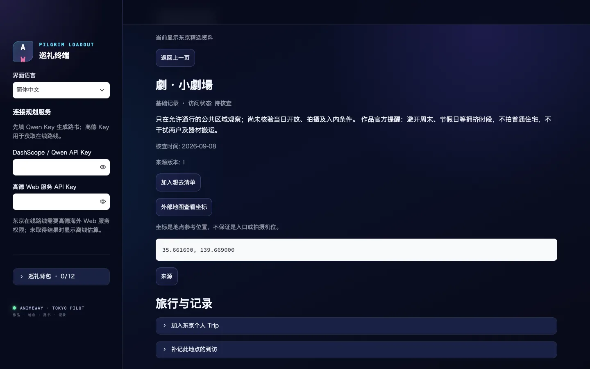
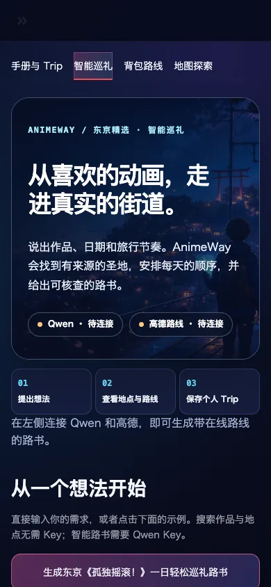

<div align="center">

<p><code>ANIME PILGRIMAGE NAVIGATOR · 聖地巡礼</code></p>

# AnimeWay · 二次元圣地巡礼

### 穿过次元壁，抵达故事发生的地方。


<br><br>


</div>

AnimeWay 将作品与地点发现、东京精选手册和个人 Trip 接成一条流程：**选作品与时间 → 查看草案 → 修改 → 保存 → 当天使用**。表单、自然语言路书、地图、手册与临时背包最终进入同一个 Trip 编辑器；交通和时间由同一套规则评估。

当前是东京试点，支持 1—3 日行程。短途步行仅给出带说明的估算；东京公交／铁路尚无已验收的在线路线提供方，时间与费用保持“待核查”。真实用户、手机设备和现场试走仍需验收，因此项目不标记为公开发布就绪。完整范围见[验证状态](docs/validation.md)。

[快速开始](#快速开始) · [界面预览](#界面预览) · [使用流程](#使用流程) · [架构说明](docs/architecture.md) · [部署与维护](docs/operations.md)

## 界面预览

下方保留了项目原有的搜索与地点探索演示。截图拍摄于三入口导航调整前，展示的是历史界面；当前操作入口以本页的使用流程为准。



| 作品搜索入口 | 作品搜索结果 |
|---|---|
|  |  |

| 地点列表 | 地点详情 |
|---|---|
|  |  |

<p align="center"><br><small>手机宽度示意；新界面仍需真实设备验收。</small></p>

截图中的作品封面由 Bangumi 实时提供，权利属于各自权利人；场景图片的展示依据仍须逐项核对。

## 快速开始

需要 Python 3.10–3.13。推荐使用仓库锁文件：

```bash
uv sync --frozen
uv run streamlit run app.py
```

打开 `http://localhost:8501`。本地搜索、表单规划和 Trip 草案不需要 API Key；可在侧栏填写 DashScope / Qwen Key 启用 AI 路书。高德 Key 只用于旧搜索结果的可选地址补充，不参与 Trip 交通评估。应用不会自动读取 `.env` 文件。

没有 `uv` 时也可用 `requirements.txt` 安装依赖，但版本范围安装不保证与锁文件完全一致：

```bash
python -m venv .venv
source .venv/bin/activate
python -m pip install -r requirements.txt
python -m streamlit run app.py
```

## 使用流程

1. 在「规划行程」选作品、日期、天数、节奏和步行或公共交通偏好。自然语言输入会先变成可见的需求卡，再生成草案。
2. 核对每天的地点、顺序、访问状态、步行估算及公共交通待核查项。修改时间、地点或单段交通后会重新评估。
3. 草案会在当前私人身份下暂存；点击“保存到我的行程”后继续使用同一个 Trip ID。可重新打开、编辑和恢复规划版本。
4. 当天模式优先显示当前站、下一步和剩余交通。打开外部导航不会自动记到访；到访、跳过与临时关闭由用户分别确认。
5. 旅行后可添加私密记录、照片与场景配对，并按需预览、分享或撤下公开副本。

「探索地点」提供地图、手册与临时背包。旧手册副本继续可读和导出，但不再新建或用于旧版当天模式；转换前会逐项列出可选、重复、缺失或关闭的地点，以及历史资料变化。背包只用于选点和建立个人 Trip 草案，不另算一条路线。愿望清单、旧资料和备份在「我的行程」的二级入口。

## 交通与数据边界

- 步行时间按直线距离 × 1.35、65 米／分钟估算，不代表真实街道路径；直线距离超过 5 公里时不提供确定步行时间。
- 选择公共交通时不会自动切成步行或驾车。用户可明确覆盖某一段交通方式；覆盖会随 Trip 保存、备份与恢复。
- 未知时间和票价不按零计算；前序时间未知时，后续抵达和完整结束时间也保持待核查。外部地图须由用户核对当前位置、路线和现场访问规则。
- 全库索引用于发现，不表示其中所有地点都已核验。可规划 Trip 只接收东京精选范围内当前可用的地点；关闭或撤下的历史选择保留并提示处理。
- AI 不得生成或改写坐标、交通分钟、费用、开放时间和到访事实。

## 数据与配置

私人数据默认写入 `.animeway/private.sqlite3`，该目录被 Git 忽略。匿名身份凭据保存在浏览器，服务端只存摘要；清除浏览器数据或换设备前，应先正式保存 Trip 并下载备份。未保存草案不包含在用户 JSON 备份中。恢复备份会创建独立副本，没有跨设备自动同步。

| 环境变量 | 用途 |
|---|---|
| `ANIMEWAY_DATA_DIR` | 私人数据库与反馈文件的持久目录 |
| `ANIMEWAY_SNAPSHOT_DIR` | 已校验的公开 JSON／SQLite 成对快照目录 |
| `ANIMEWAY_INDEX_DB` | 兼容旧全库检索索引路径 |
| `ANIMEWAY_MAP_ENABLED` | 设为 `0` 隐藏地图子入口，保留文字探索 |
| `ANIMEWAY_PUBLIC_URL` | 分享链接使用的站点根地址 |
| `DASHSCOPE_API_KEY` | 可选 AI 路书与建议 |
| `AMAP_API_KEY` | 旧搜索的可选地点地址补充 |

服务部署、完整备份、索引刷新与回退、AI 配额、审核命令见[部署与维护](docs/operations.md)。

## 项目结构与检查

`app.py` 负责页面编排；`components/` 实现 Streamlit 界面；`core/` 保存 Trip、交通、资料核对和持久化规则；`data_factory/` 构建公开索引；`knowledge_base/` 保存公开索引与东京精选内容；`scripts/` 是维护者命令；`assets/` 是样式和浏览器组件；`tests/` 按业务行为组织回归测试。各模块的数据边界见[架构说明](docs/architecture.md)。

```bash
uv sync --frozen --group dev
uv run ruff check .
uv run mypy
uv run python -m unittest discover -s tests -v
uv run python -m data_factory.release --root /tmp/animeway-public-snapshots --offline
```

CI 还检查锁文件、模块编译和浏览器脚本语法。当前验收结果与剩余现场任务见[验证状态](docs/validation.md)。

## 数据来源与许可

项目代码采用 [MIT License](LICENSE)。仓库的运行用公开数据、作品资料、封面、场景图和地图服务分别受原来源条款约束，不因代码开源而自动适用 MIT。全库数据来源包括 [Bangumi](https://bgm.tv/) 与 [Anitabi](https://anitabi.cn/)；来源登记见[原始数据说明](knowledge_base/raw/README.md)，东京精选结构见[东京内容说明](knowledge_base/pilot/README.md)。Anitabi [开放 API 文档](https://navi.anitabi.cn/docs/api/)列有数据使用和署名要求。未取得展示依据的场景图片仅链接到来源，不打包进仓库。出发前请核对官方信息，并尊重居民、店铺及拍摄规则。

**English / 日本語:** AnimeWay is a Tokyo pilot for one editable pilgrimage Trip, with local place discovery, optional Qwen planning, private journals and route sharing. Walking times are estimates; transit time and fare remain unverified. / AnimeWay は東京向けの巡礼 Trip 試作版です。徒歩時間は推定、公共交通の時間と運賃は要確認です。編集画面は主に中国語です。
